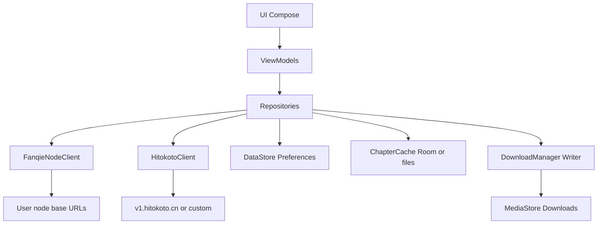

# Android 番茄小说下载器

Feature Name: 2026-07-24-android-app  
Updated: 2026-07-24

## Description

在仓库 `android/` 下用 **Kotlin + Jetpack Compose** 实现与 Web 视觉对齐的本地客户端：搜索、简介、单本 TXT 下载；设置面板管理番茄节点 API 与一言 API。无 WebView 套壳；网络直连用户配置的节点（Android 无浏览器 CORS 限制）。CI 构建 APK 发布到 GitHub Release。

## Architecture



### Layers

| 层 | 职责 |
|----|------|
| UI | 主页搜索、简介 BottomSheet/Screen、下载进度对话框、设置页 |
| ViewModel | 状态、一次性事件（Snackbar）、协程取消 |
| Repository | 组合节点轮询、缓存、配置读写 |
| Network | OkHttp + kotlinx.serialization / org.json 解析节点 JSON |
| Storage | DataStore 存节点列表与一言 URL；章节缓存目录；MediaStore 写 TXT |

## Components and Interfaces

### 1. `FanqieNodeClient`

对齐 `browser-client.js` 路径约定：

| 方法 | 请求 |
|------|------|
| `search(query, offset)` | `GET {base}/search?query=&offset=` |
| `info(bookId)` | `GET {base}/info?book_id=` |
| `catalog(bookId)` | `GET {base}/catalog?book_id=` |
| `content(itemId)` | `GET {base}/content?item_id=` |
| `probe(base)` | `GET {base}/content?item_id=7580458932431225368` 测活 |

**节点选择策略**

1. 读取启用节点列表（用户排序）
2. 对 search/info/catalog/content：按序尝试；成功则记住 `lastGoodBase` 优先下次
3. 单次请求超时默认 15s；章节 content 可 20s
4. 若启用列表为空：抛出 `NoEnabledNodeException`，UI 引导设置

**响应兼容**：与 Web 相同，容忍字段别名（`book_id` / `bookId`，`item_id` / `itemId`，目录数组嵌套等）。解码逻辑从 `browser-client.js` 的 catalog/content 解析移植为 Kotlin。

**charset**：若节点返回需字体映射的编码内容，首版优先使用节点已解码明文；若与 Web 一样依赖 `charset.json`，将 `charset.json` 作为 assets 打入 APK 并复用映射表。

### 2. `HitokotoClient`

- 默认 URL：`https://v1.hitokoto.cn/`
- 解析：JSON 时取 `hitokoto` 为正文；来源优先 `from`，作者 `from_who`；展示串：
  - 有 from_who 与 from：`{hitokoto}——{from}·{from_who}` 或 `——{from_who}《{from}》`（from 像作品名时用后者的简化：首版固定 `{text}——{from}`，有 from_who 则 `{text}——{from}·{from_who}`）
  - 纯文本 body：原样
- 失败：内置 ≤30 条短兜底（可从现有 `DAILY_MESSAGES` 精简，无游戏大段）

### 3. `NodeConfigRepository` / Settings UI

DataStore JSON 示例：

```json
{
  "nodes": [
    {"id": "builtin-1", "name": "节点1", "baseUrl": "http://110.42.57.146:4018", "enabled": true, "builtin": true},
    {"id": "custom-uuid", "name": "我家", "baseUrl": "http://192.168.1.8:8080", "enabled": true, "builtin": false}
  ],
  "hitokotoUrl": "https://v1.hitokoto.cn/",
  "lastGoodBase": "http://43.143.149.30:8008"
}
```

设置页能力：列表拖拽排序（可选 v1.1）、开关、编辑 URL、删除（仅 `builtin=false`）、测活、恢复默认、一言 URL 编辑与「测试一言」。

### 4. `DownloadRepository`

流程：

1. `catalog(bookId)` → 章节列表
2. 按 start/end 切片（1-based 章号；0/空=整本）
3. 逐章 `content`；断点续传读 `filesDir/chapter_cache/{bookId}/{itemId}.json`
4. 合并 TXT：`《书名》\n\n第x章 标题\n正文\n\n...`
5. 写入公共 Download：`ContentValues` + `MediaStore.Downloads`（API 29+）；API 28- 使用 `WRITE_EXTERNAL_STORAGE` 写 `Environment.DIRECTORY_DOWNLOADS`
6. 进度：`Flow<DownloadProgress(current, total, title)>`；`Job.cancel` 支持取消

### 5. UI 结构

```
MainActivity
├── SearchScreen          // 黑底 + 圆角白卡 + 搜索框 + 结果 LazyColumn + 一言角标
├── BookDetailSheet       // 简介 + 下载按钮
├── DownloadOptionsDialog // 起止章、续传、开始
└── SettingsScreen
    ├── NodeList
    └── HitokotoConfig
```

主题色：背景 `#0a0a0a` 级深色；卡片白/近白圆角 16–24dp；主按钮深色字浅底或反白描边，对齐 Web `styles.css` 主卡片气质。

主页背景图使用外接随机图 API：`https://t.alcy.cc/ycy`（Coil 加载，上覆半透明遮罩保证白卡片可读）。

### 6. 工程与 CI

```
android/
  settings.gradle.kts
  build.gradle.kts
  app/
    src/main/AndroidManifest.xml
    src/main/java/.../fanqiedl/
    src/main/res/
    src/main/assets/charset.json   // 若需要
  README.md
.github/workflows/android-release.yml
```

- minSdk：26；targetSdk：34 或 35
- 权限：`INTERNET`；API≤28 `WRITE_EXTERNAL_STORAGE`（maxSdkVersion=28）；通知权限仅当后续做前台下载服务时再加（v1 可用应用内进度，可不申请 POST_NOTIFICATIONS）
- Workflow：`on: push tags: ['v*']` 与 `workflow_dispatch`；`./gradlew :app:assembleRelease`（首版可用 assembleDebug 降低签名复杂度，或 debug 签名 release 构建）；`softprops/action-gh-release` 上传 APK

### 7. 与 Web 的差异（有意为之）

| 点 | Web | Android |
|----|-----|---------|
| 一言 | 本地 Speech.txt 大词库 | 外接 Hitokoto API |
| CORS/proxy | 需要 | 不需要 |
| 批量多选 | 有 | v1 不做 |
| 阅读页 | reader.html | v1 不做 |
| 节点配置 | 代码/localStorage 有限 | 完整面板 |

## Data Models

```kotlin
data class NodeConfig(
  val id: String,
  val name: String,
  val baseUrl: String, // 无尾 /
  val enabled: Boolean,
  val builtin: Boolean,
)

data class BookSummary(
  val bookId: String,
  val title: String,
  val author: String?,
  val coverUrl: String?,
  val description: String?,
  val meta: String?,
)

data class ChapterRef(val itemId: String, val title: String, val index: Int)

data class DownloadRequest(
  val bookId: String,
  val title: String,
  val startChapter: Int, // 0 = from first
  val endChapter: Int,   // 0 = to last
  val resume: Boolean,
)
```

## Correctness Properties

1. 任意时刻启用节点数为 0 时，search/download 入口不可成功发起请求
2. 同一 `bookId` 下载文件名可区分多次任务（时间戳或序号），避免静默覆盖用户已有文件
3. 取消下载后不继续写文件；已写入的不完整文件删除或标为 `.partial` 后清理
4. 节点 baseUrl 规范化：trim、去尾 `/`、仅允许 http/https
5. 配置变更后下一次网络调用使用新列表（无进程内过期缓存超过一次请求）

## Error Handling

| 场景 | 处理 |
|------|------|
| 全节点失败 | Snackbar/对话框：全部节点不可用，建议测活或换源 |
| 单章失败 | 默认跳过该章，文末或结果中列出失败章号；连续失败 N 章（如 10）可中止 |
| 存储权限/MediaStore 失败 | 提示失败原因；可选回退写到 `getExternalFilesDir(Downloads)` |
| 一言失败 | 静默兜底句 |
| 非法 URL | 设置页保存时校验，禁止写入 |

## Test Strategy

1. **单元**：URL 规范化、章节范围切片、Hitokoto JSON 拼装、catalog JSON 多形态解析（fixtures 来自真实节点采样）
2. **仪器/手动**：空节点阻断、恢复默认、测活延迟展示、搜索→简介→下载到 Download 目录、取消下载
3. **回归**：与 Web 同一本书 ID（如示例书）目录章数一致（允许节点差异导致短暂不一致时以当前成功节点为准）

## Implementation Phases

1. 空壳工程 + 主题 + 导航
2. DataStore 节点默认值 + 设置 CRUD + 测活
3. NodeClient search/info/catalog/content
4. 搜索 UI + 简介
5. 下载 + MediaStore + 进度/取消
6. 一言
7. CI APK + android/README

## References

- 当前工作区 `/browser-client.js`：节点协议与解析
- 当前工作区 `/nodes.alive.json`：默认主机
- 当前工作区 `/api/search.js`：搜索字段兼容参考
- 当前工作区 `/styles.css`：黑底圆角卡片视觉
- Hitokoto API：`https://v1.hitokoto.cn/`
